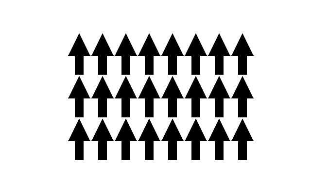
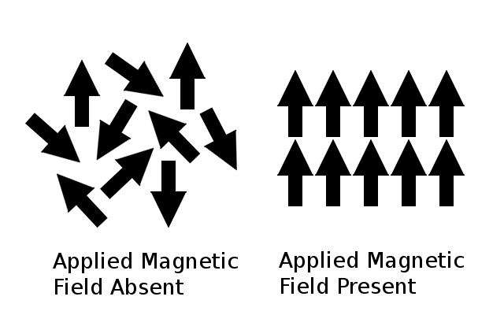

# 2D Ising model

This is a simulation of the 2D [Ising Model](https://en.wikipedia.org/wiki/Ising_model), a simple model of ferromagnetism in solid state physics. The project has been done for the [Udacity C++](https://www.udacity.com/course/c-plus-plus-nanodegree--nd213) Nanodegree course.

## Dependencies for Running Locally
* OpenCV >= 4.1
  * The OpenCV 4.1.0 source code can be found [here](https://github.com/opencv/opencv/tree/4.1.0)
* cmake >= 3.7
  * All OSes: [click here for installation instructions](https://cmake.org/install/)
* make >= 4.1 (Linux, Mac), 3.81 (Windows)
  * Linux: make is installed by default on most Linux distros
  * Mac: [install Xcode command line tools to get make](https://developer.apple.com/xcode/features/)
  * Windows: [Click here for installation instructions](http://gnuwin32.sourceforge.net/packages/make.htm)
* gcc/g++ >= 5.4
  * Linux: gcc / g++ is installed by default on most Linux distros
  * Mac: same deal as make - [install Xcode command line tools](https://developer.apple.com/xcode/features/)
  * Windows: recommend using [MinGW](http://www.mingw.org/)

## Basic Build Instructions

1. Clone this repo.
2. Make a build directory in the top level directory: `mkdir build && cd build`
3. Compile: `cmake .. && make`
4. Run it: `./ising-model`.

## A Bit of Physics

If you take a refrigerator magnet and heat it up, it will suddenly lose its magnetic properties at a specific temperature. But what does temperature have to do with magnetism? 

Some atoms in materials have a magnetic moment - imagine tiny magnets sitting inside the material and interacting with each other. The kind of interaction depends on the properties of the material. In some cases, it is energetically favorable for magnetic moments to align parallel to each other. If the interaction is so strong that most magnetic moments point in the same direction, then the whole material becomes a magnet. 

High temperature introduces chaos into the system. Even if the parallel orientation is energetically favorable, it is just one configuration out of a huge number of possibilities. If the temperature becomes high enough, chaos overcomes order and the material undergoes a phase transition.
 
|  |  |
|:---: |:---:|
| Below the critical temperature | Above the critical temperature  | 

([image source](https://en.wikipedia.org/wiki/Curie_temperature))

The Ising model is a simple model that can describe phase transition from an ordered state
to an unodrered state. In the model, the magnetic moments (we will also call them spins) are binary and can only point up (+1) or down (-1). Magnetic moments sit on a 2D lattice, their interaction with neighbors is described by the coupling constant `J`. 

* `J > 0`: parallel orientation is preferable
* `J < 0`: antiparallel orientation is preferable

If an external magnetic field `B` is present, magnetic moments additionally try to align parallel to it. 

If `J > 0` and the temperature is below the critical value, there will be more moments pointing in one direction than the other and the material will become a magnet. 

## Code Structure

The program makes use of concurrency to simultaneously update the lattice and evaluate and display results. It is structured around the `SpinLattice` object, which is used to represent and modify the lattice. All methods which read or modify the lattice are protected by a private mutex and `guard_lock`s to enable concurrent programming.

First, the user is asked to enter input parameters: the size of the lattice, the coupling constant `J`, the magnetic field `B` and the temperature `T`. The program ensures that the given values are valid and lie in a reasonable range. He can also choose between two simulation algoritms: the single cluster method [1] and the heat bath method.

After that, it launches three threads for simulation, evaluation and display. The lattice is passed by pointer to the simulation thread and the display thread. Additionally, the simulation and evaluation threads communicate with each other through a `MessageQueue`. 

### Simulation Thread

The simulation algorithm runs the simulation algorithm in an infinite while-loop. It modifies the lattice and takes measurements of the energy density and magnetization. After a given number of simulation steps, averaged measurements are sent via `MessageQueue` to the evaluation thread. 

The single cluster algorithm selects a cluster of spins, i.e., connected spins with the same orientation, and flips each spin from the cluster with a probability which depends on the physical parameters of the system. 

The heat bath algorithm selects one random spin and sets its value randomly. The probability depends on the energy contribution of the spin.

### Evaluation Thread

The evaluation thread waits for a message from the `MessageQueue`. Once measurements are available, it pulls all new measurements from the queue and saves them. Only the most recent 100 measurements are used, older measurements are discarded to speed up the calculations.

First, the average energy and magnetization density are computed by taking the average of all recent measurements. Then, the [Jackknife algorithm](https://en.wikipedia.org/wiki/Jackknife_resampling) is performed on both measurement vectors to estimate the variance of the measurements. The estimated error is equal to the square root of the variance. 

### Display Thread

The display thread repeatedly calls the `SpinLattice::updateMat(cv::Mat &image)` method of the lattice, which writes the values of the lattice into an OpenCV matrix. This matrix is then displayed using the `cv::imshow()` function.

### Expected Behavior

After the user enters starting parameters, the simulation starts. The current state of the lattice is shown in an additional window. Measuruments are outputed to the console each second. It can take some time for the simulation to collect enough data for error estimation.

## Rubric Points

* The project demonstrates an understanding of C++ functions and control structures.
* The project reads data from a file and process the data, or the program writes data to a file. 
  * See `userInput.cpp` file, lines `12-20`.
* The project accepts user input and processes the input.
  * See `userInput.cpp` file, lines `21-60`
* The project makes use of references in function declarations.
  * See `spinLattice.cpp` file, line `70`, `userInput.cpp` file, line `9`
* The project uses multithreading.
  * See `main.cpp` file, lines `47-53`
* A mutex or lock is used in the project.
  * See `SpinLattice.cpp` file, lines `21`, `33`, `49`, `68`, `74`
* A condition variable is used in the project.
  * See `MessageQueue.h` file, line `14`

## Things to Try Out

* If `J = 1.` and `B = 0.`, then the critical temperature for an infinite lattice is approximately equal to `T = 2.26`. The average magnetization density should vanish above that point and be larger than zero below. 
* If `J < 0`, the neighbors will try to point in opposite directions. Such materials are called antiferromagnets. Although the average magnetization cancels out, antiferromagnets still undergo a phase transition from an ordered state to an unordered - it is just not very noticeable from the outside.
* If `B > 0`, the material will be magnetic even at high temperatures. Such materials are called paramagnets.

## References

[1] Wolff, U. (**1989**). Collective Monte Carlo Updating for Spin Systems _Phys. Rev. Lett., 62,_ 361–364.
